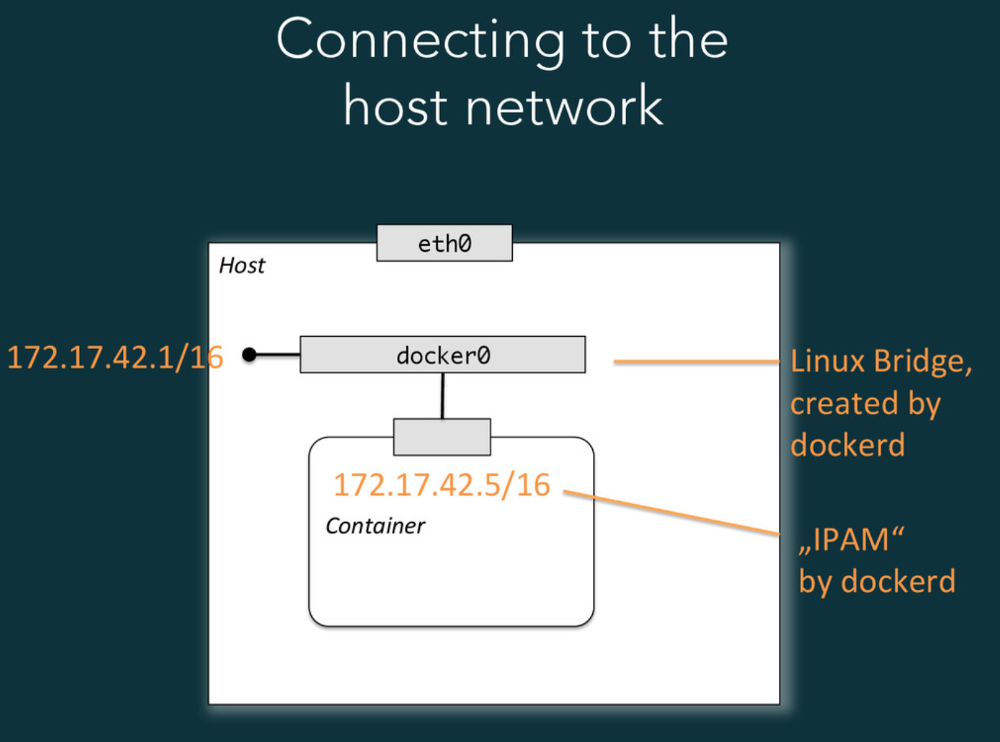
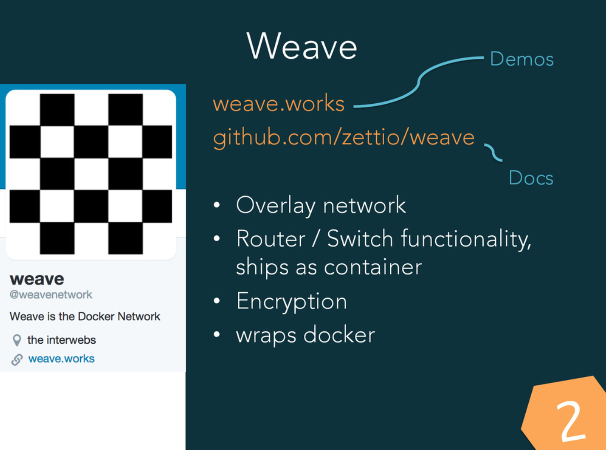
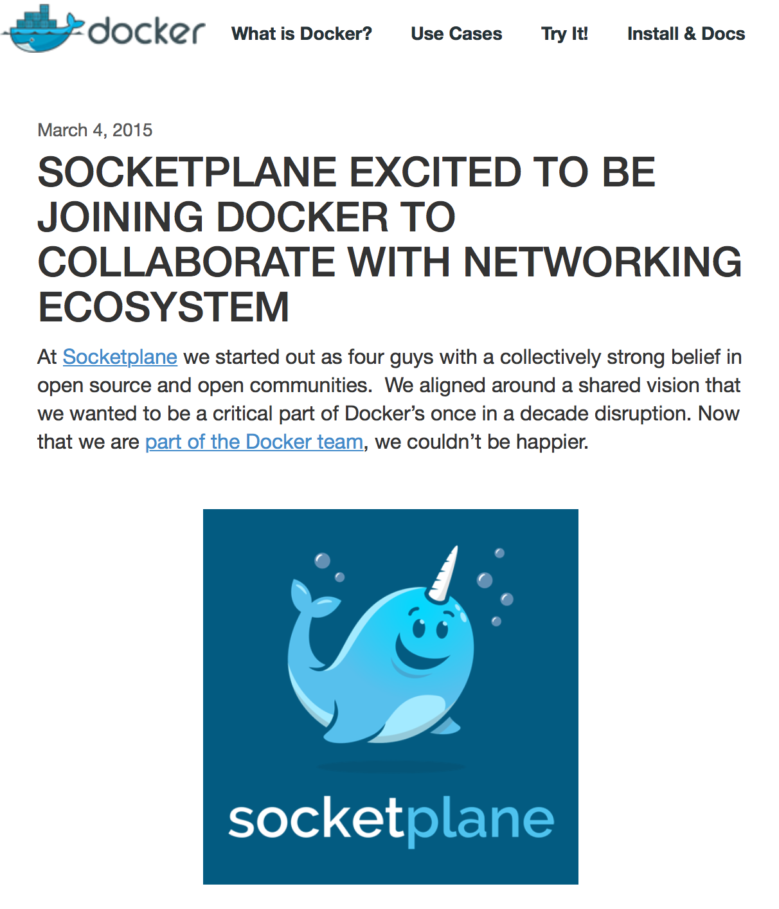
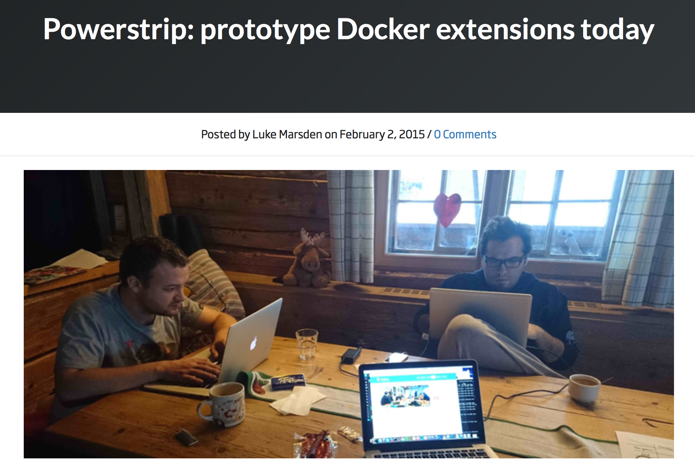
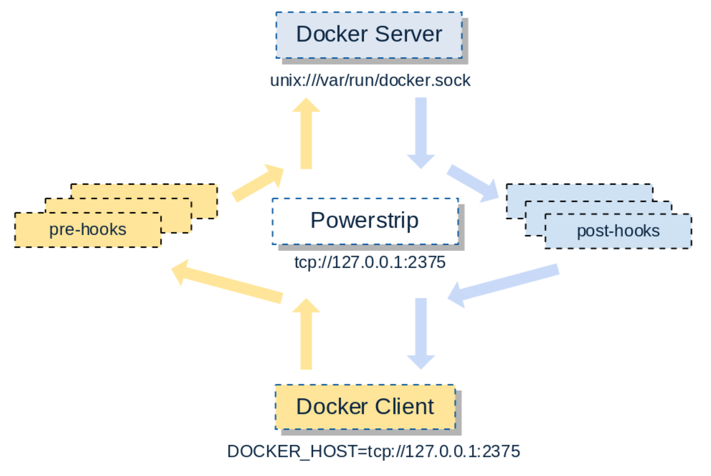

footer: © Dr. Stefan Schimanski, 2015
slidenumbers: true


# Cluster Networking with Docker

> Dr. Stefan Schimanski, \#dockerffm, Mar/30/2015

---

## About me

- Freelancing developer, system engineer, engineering manager
- active Mesos Marathon contributor
- Blog [http://sttts.github.io](http://sttts.github.io)
- Code [http://github.com/sttts](http://github.com/sttts)
- [@the1stein](http://twitter.com/the1stein)

---
# Part 1 – Docker Cluster with Container IPs
## Stop doing port management!

### References
- ["Poor Men's Routable Container IPs for Docker Clusters"]({http://sttts.github.io/docker/network/2015/01/31/poor-mens-cluster-container-ips.html}), http://sttts.github.io

---

## 0.2 The Goal

- a cluster-wide, unique, automatically assigned IP address for every container
- which is routable (switchable) within a private network
- without any DHCP or other complicated infrastructure
- without an overlay network
- without OpenVSwitch.

---

## 0.3 We need

- a large enough free IP range (`10.2.0.0/16` in this example)
- a private network interface (`eth1` in this example)
- `bridge-tools` installed on two Docker hosts (Ubuntu 14.04 in this example).

---



-- from Andreas Schmidt's talk "[Docker Networking](https://speakerdeck.com/aschmidt75/docker-networking)"

---

## 1. Basic Idea

- our own **custom bridge** `br0` on each node
  - as the Docker bridge – instead of the usual `docker0`.
  - connected via `eth1` to the wire forming a **cluster layer 2 net**
- a **private IP range** for each node, *without overlaps*

- **IP assignment via Docker**'s `--fixed-cidr`

---

## 2. Setting up the Bridge

We setup the bridge in `/etc/network/interfaces`:

```
auto br0
iface br0 inet static
    address 10.2.0.1
    netmask 255.255.0.0
    bridge_ports eth1
    bridge_stp off
    bridge_fd 0
```

on each node. We choose IPs of the shape `10.2.0.x` as host addresses. 

---

# ... and starting the bridge

Then we start the bridge with

```bash
$ ifup br0
```

If there was an address on `eth1` before, make sure to remove it before this with

```bash
$ ifconfig eth1 0.0.0.0
```

---

## 3. Changing the Docker Daemon Network Settings

Tell Docker about the bridge and the network IP range in `/etc/default/docker`:

```bash
DOCKER_OPTS="--bridge=br0 --fixed-cidr=10.2.1.0/24"
```

`10.2.1.0` chosen according to the host, i.e. the host with `10.2.0.x` gets `10.2.x.0/24` as its IP range for the containers.

---

## ... and restarting Docker

```bash
$ restart docker
$ docker run -it ubuntu /bin/bash
root@508b511dab3e:/# ip addr show dev eth0
7: eth0: <BROADCAST,UP,LOWER_UP> mtu 1500 qdisc noqueue state UP group default 
    link/ether 02:42:0a:01:01:02 brd ff:ff:ff:ff:ff:ff
    inet 10.2.1.2/16 scope global eth0
       valid_lft forever preferred_lft forever
    inet6 fe80::42:aff:fe01:102/64 scope link 
       valid_lft forever preferred_lft forever
```

**Note:** Docker assigns `10.2.1.2/16`, not `10.2.1.2/24` to the container interface.

---

## 4. Cross Host Connectivity

Make sure IPv4 forwarding is active[^1]:

```bash
$ cat /proc/sys/net/ipv4/ip_forward
1
```

[^1]: If you use VirtualBox to test this (e.g. in Vagrant), make sure to allow promiscuous mode in the VM network settings.

---

```bash
node2 $ docker run -itd sttts/python-ubuntu:latest \
    python -m SimpleHTTPServer 80
29351797

node2 $ docker inspect --format '{{ .NetworkSettings.IPAddress }}' 2935
10.2.2.5

node1 $ curl -I 10.2.2.5:8080
HTTP/1.0 200 OK
Server: SimpleHTTP/0.6 Python/2.7.6
Date: Sat, 31 Jan 2015 17:12:02 GMT
Content-type: text/html; charset=ANSI_X3.4-1968
Content-Length: 810
```

Your network works. Congratulations. :+1:

---

# Part 2 – [Weave](https://github.com/zettio/weave) & Docker

## References
- ["Adventures with Weave and Docker"](http://sttts.github.io/docker/weave/mesos/2015/01/22/weave.html), http://sttts.github.io

---



-- from Andreas Schmidt's talk "[Docker Networking](https://speakerdeck.com/aschmidt75/docker-networking)"

---

## 0.1 The **previous** Goals

- a cluster-wide, unique, automatically assigned IP address for every container
- which is routable (switchable) within a private network
- without any DHCP or other complicated infrastructure
- without an overlay network
- without OpenVSwitch.

---

# 0.1 The **new** Goals

- a cluster-wide, unique, automatically assigned IP address for every container
- **which is routable (switchable) over datacenter borders** or **between local datacenter and cloud**
- without any DHCP or other complicated infrastructure
-  **with securely encrypted internet traffic**

---


---

# 1. Basic Idea

- containers will live in a Weave overlay network 10.2.0.0/16
- which is shared among all Docker hosts
- one overlay network for all containers (e.g. different networks for different apps)
- IP management for free from the Docker deamon
- no `weave run`, but pure `docker run`

---

# 2.1 Setting up weave – **the usual way**

- download the weave shell script:

```bash
$ sudo wget -O /usr/local/bin/weave \
  https://github.com/zettio/weave/releases/download/latest_release/weave
$ sudo chmod a+x /usr/local/bin/weave
```

- starting the router container:

```bash
$ weave launch
```

---

```bash
$ weave expose 10.2.0.1/16
$ ifconfig weave
weave     Link encap:Ethernet  HWaddr 7a:d2:8d:b1:26:7b
          inet addr:10.2.0.1  Bcast:0.0.0.0  Mask:255.255.0.0
          UP BROADCAST MULTICAST  MTU:65535  Metric:1
          RX packets:0 errors:0 dropped:0 overruns:0 frame:0
          TX packets:0 errors:0 dropped:0 overruns:0 carrier:0
          collisions:0 txqueuelen:0 
          RX bytes:0 (0.0 B)  TX bytes:0 (0.0 B)
$ brctl show
bridge name     bridge id               STP enabled     interfaces
weave           8000.7ad28db1267b       no
```

- start a container:

```bash
$ weave run 10.2.0.2/16 -itd sttts/python-ubuntu python -m SimpleHTTPServer 80
$ curl 10.2.0.2
```

---

# 2.2 Setting up weave – **as `docker0**

- Create the `weave` bridge without `weave launch`:

```bash
$ weave create-bridge
$ ip addr add dev weave 10.2.0.1/16
```

- Configuring Docker

In `/etc/default/docker`:

```bash
DOCKER_OPTS="--bridge=weave --fixed-cidr=10.2.1.0/24"

$ start docker
```

---

- Testing Docker

```bash
$ docker run -it ubuntu /bin/bash
root@3ce56d73fc18:/# ping 10.2.0.1
PING 10.2.0.1 (10.2.0.1) 56(84) bytes of data.
64 bytes from 10.2.0.1: icmp_seq=1 ttl=64 time=0.152 ms
```

---

# 3. Automatic startup of the weave bridge

- In `/etc/network/interfaces`:

```
auto weave
iface weave inet manual
        pre-up /usr/local/bin/weave create-bridge
        post-up ip addr add dev weave 10.2.0.1/16
        pre-down ifconfig weave down
        post-down brctl delbr weave

$ ifup weave
$ ifdown weave
```

---

# 4. Connecting the hosts

```
$ weave launch
$ weave connect 192.168.0.42
```

---

## Note the following:

- **All containers** and hosts **can "see" eachother** via the weave network.
- **All ports** that container processes listen to on the weave network interface **will be accessible by all containers**.
- Those ports are **not** exposed outside of the weave network[^2]

[^2]: Can be done by the means of Docker: `docker run -itd -p 12345:80 ...`

---

# Conclusion

##  Stop doing port management, 
##  use native ports and container IPs.

---

# [fit] Thank You

---

# References

- ["Poor Men's Routable Container IPs for Docker Clusters"]({http://sttts.github.io/docker/network/2015/01/31/poor-mens-cluster-container-ips.html}), http://sttts.github.io/docker/network/2015/01/31/poor-mens-cluster-container-ips.html
- ["Adventures with Weave and Docker"](http://sttts.github.io/docker/weave/mesos/2015/01/22/weave.html), http://sttts.github.io/docker/weave/mesos/2015/01/22/weave.html

---



---



[https://github.com/ClusterHQ/powerstrip](https://github.com/ClusterHQ/powerstrip)

---



---

# Consul Service Discovery

- Start Consul:

```bash
$ consul agent -server -node=srv001 -bootstrap -data-dir ./data -client=0.0.0.0
```

- Start registrator:

```bash
$ docker run -it -v /var/run/docker.sock:/tmp/docker.sock progrium/registrator -internal consul://10.2.0.1:8500
```

---

- Lookup webserver service:

```bash
$ dig @10.1.0.1 -p 8600 python-ubuntu.service.dc1.consul. ANY

; <<>> DiG 9.9.5-3-Ubuntu <<>> @10.1.0.1 -p 8600 python-ubuntu.service.dc1.consul. ANY
; (1 server found)
;; global options: +cmd
;; Got answer:
;; ->>HEADER<<- opcode: QUERY, status: NOERROR, id: 46182
;; flags: qr aa rd; QUERY: 1, ANSWER: 1, AUTHORITY: 0, ADDITIONAL: 0
;; WARNING: recursion requested but not available

;; QUESTION SECTION:
;python-ubuntu.service.dc1.consul. IN   ANY

;; ANSWER SECTION:
python-ubuntu.service.dc1.consul. 0 IN  A       10.2.1.2

;; Query time: 4 msec
;; SERVER: 10.1.0.1#8600(10.1.0.1)
;; WHEN: Mon Mar 30 13:37:47 UTC 2015
;; MSG SIZE  rcvd: 98
```
